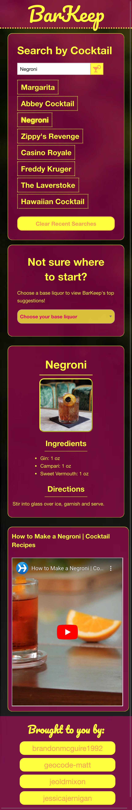

# Team 5 | Project 1

Deployed Link:
https://jessicajernigan.github.io/team5-project-1/

GitHub Repo:
https://github.com/jessicajernigan/team5-project-1

## User Stories

### I.
As an amateur bartender at home, I want to find directions and inspiration for new cocktail recipes that are easy to use on desktop, tablet, and phone. 

### II. 
As an indecisive consumer trying to decide on the perfect cocktail recipe, I want to toggle through my previous search terms while I narrow down my choices, so I need an application that will save my previous search terms even after I’ve reloaded the page.

### III. 
As a bored captive of quarantine, I want to liven things up with new cocktail recipes, so I want an app that will return some new and interesting results based on my search preferences. 

## Features
* The ability to search for cocktail by name
* Ideas for drinks based on a selected base liquor
* Ingredients, directions, and image, and a how-to video populate for each drink selected

## Interactions

### Mobile

### Tablet (Pre-Interaction)

### Tablet (Post-Interaction)

<!-- Pic here of mobile website -->
