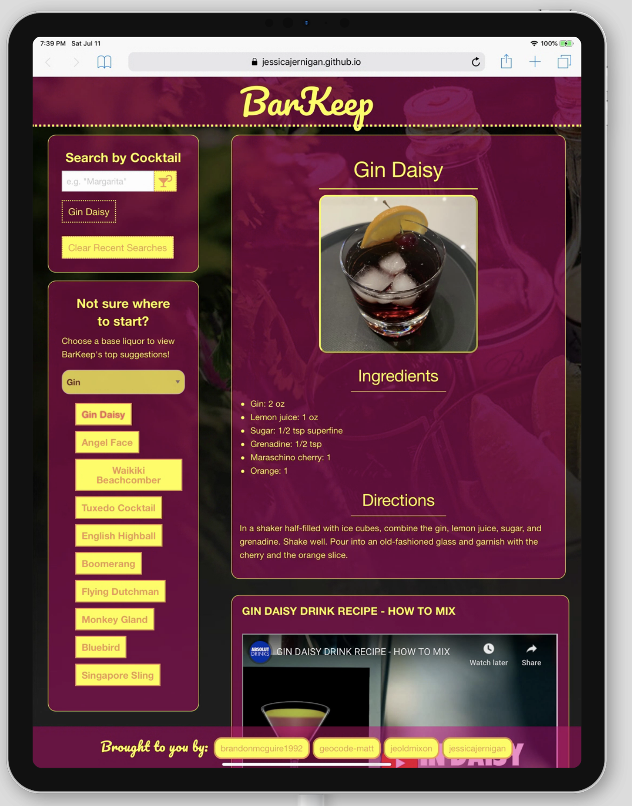

# Team 5 | Project 1

[Link to live page](https://jessicajernigan.github.io/team5-project-1/)

[Presentation Deck](https://docs.google.com/presentation/d/1Em1FzVksNaFpVqclrvjYfwuffNnJaLdd8lgCOxqCgi4/edit?usp=sharing)

Whether the bars in your city are shut down due to COVID-19 concerns or you just want to liven up a night at home, BarKeep makes it easy to access your favorite cocktail recipes or discover new ones, right from your desktop or mobile device.

## Key Features
* Search for cocktails by name
* Return cocktail suggestions based on a selected base liquor
* Ingredients, directions, image, and a how-to video populate for each drink selected
* Recent searches are saved to the page and populate after reload
* Responsive design

## User Stories

### I.
As an amateur bartender at home, I want to find directions and inspiration for new cocktail recipes that are easy to use on desktop, tablet, and phone. 

### II. 
As an indecisive consumer trying to decide on the perfect cocktail recipe, I want to toggle through my previous search terms while I narrow down my choices, so I need an application that will save my previous search terms even after I’ve reloaded the page.

### III. 
As a bored captive of quarantine, I want to liven things up with new cocktail recipes, so I want an app that will return some new and interesting results based on my search preferences. 

## Interactions

### Mobile

### Tablet (Pre-Interaction)

### Tablet (Post-Interaction)

